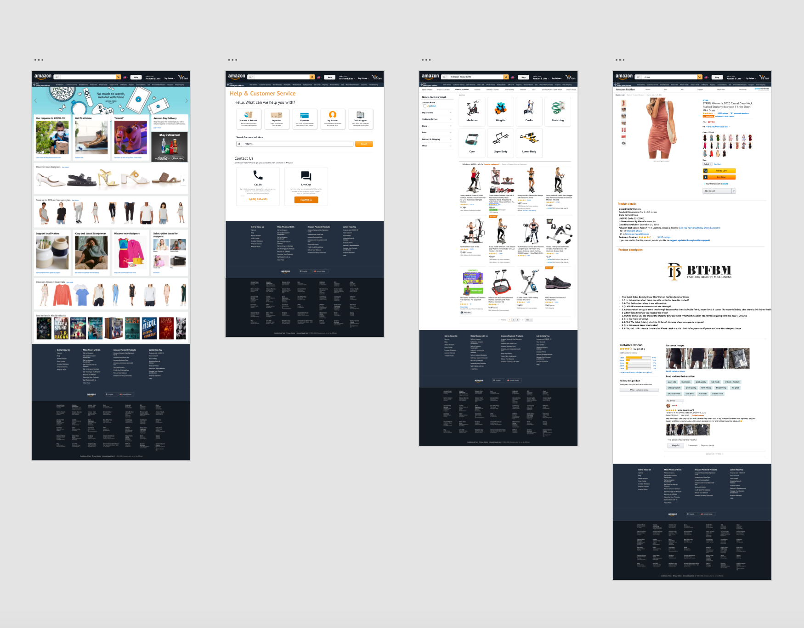
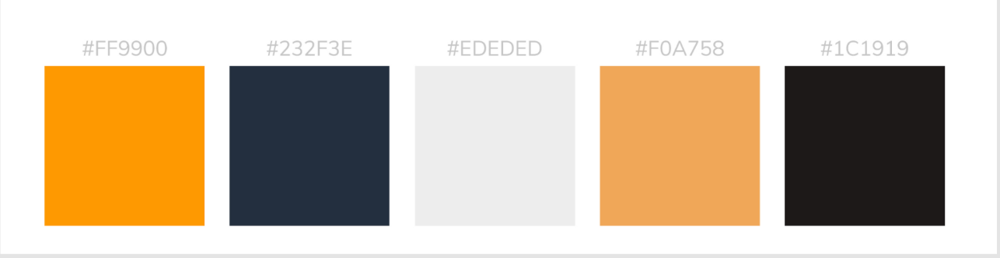
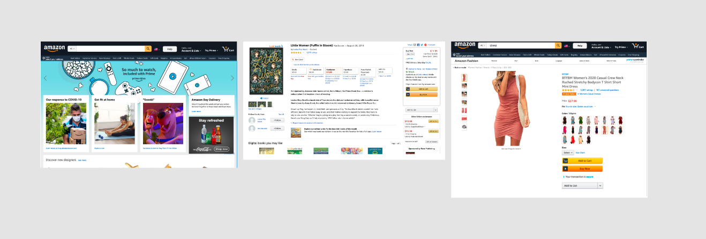
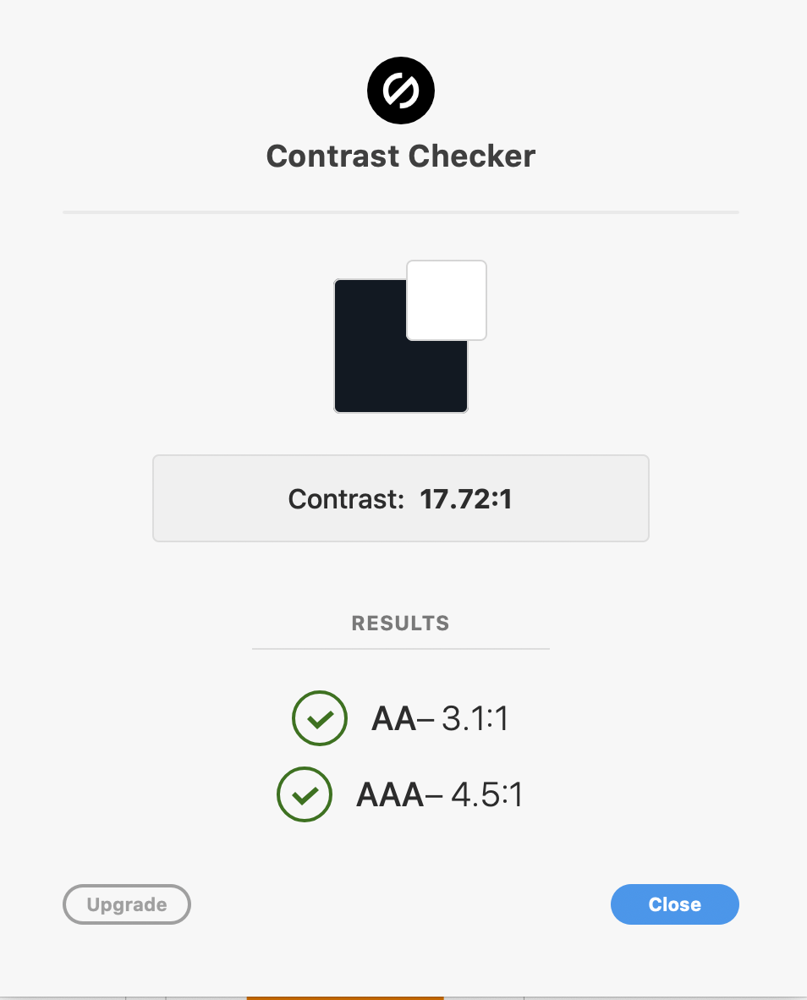
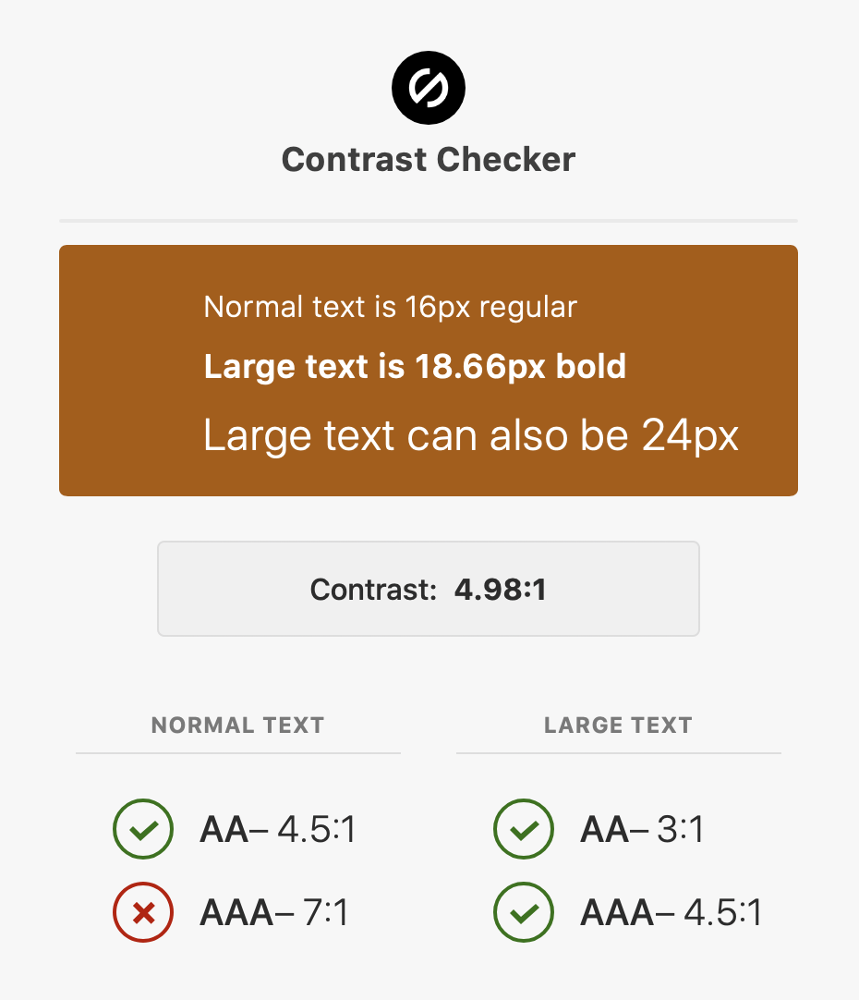
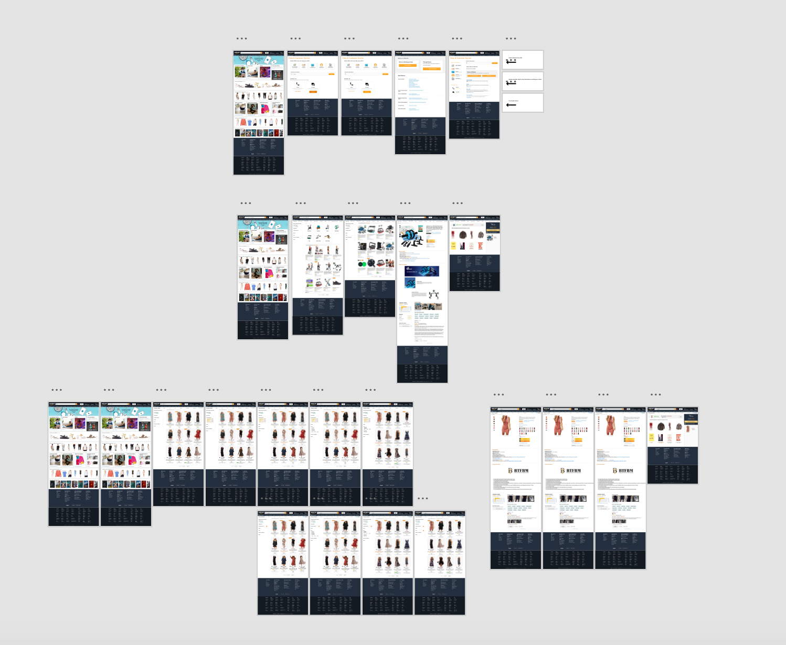
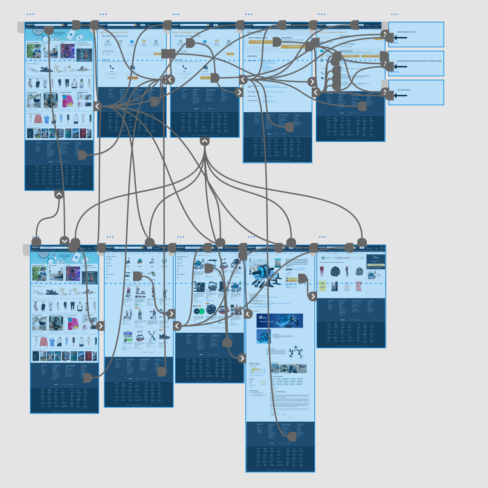
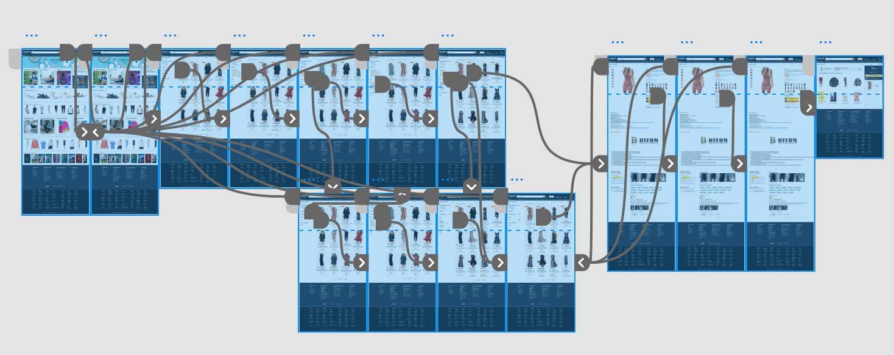

# ASSIGNMENT07
## Project Description
### Summary:
My user research project focuses on creating a quick, less frustrating, and more user-friendly online shopping experience for Amazon. While Amazon is a very well-known and widely-used website, there is large room for improvement for its user experience, especially in terms of accessibility, consistency, and functionality. The community of Amazon users is large, however, to accomodate users with less technological experience, Amazon needs a way to connect with their users quickly and directly. Through my user research and designs, I hope to make Amazon shopping experience faster, but still enjoyable for users, and make help on the website more accessible and personal. For this assignment I have created a high-fidelity prototype of my newly designed Amazon page.

### Purpose:
The purpose of a high-fidelity prototype is to make interactive designs and to study the functionality and usability of new design features. The high-fidelity prototype below is based on my low-fidelity prototpes, but now include more visual design information, such as graphic elements, colors, UI components, and familiar Amazon features. High-fidelity prototypes are interactive, validate the user interaction flow, and help find possible shortcomings to designs that need to be improved.

### The Process:
The prototype below was created using AdobeXD in which I created interactive user flows for three website acitivites containing the three new design features I added to improve Amazon's user experience. After conducting user research, creating 3 user personas, and creating hand-drawn low-fidelity prototypes, I used the feedback from each step of the UX-design process to create high-fidelity prototypes to fit the needs of each persona. I recreated the basic interface of Amazon by including screenshots, and removed and added UI components to create a clean, yet familiar, look for my new web design. I implemented Amazon's color palette and similar font into these components so that they would fit in with the original Amazon interface (this will be discussed further in the graphic design section). Then, I used the prototyping tools on AdobeXD to make the buttons and other features interactive and usable.

### Tasks:
#### Task 1: Browse for exercise equipment by looking through grouped categories
In this task, our user wants to purchase exercise equipment that they can use at home. The user doesn't have anything specific in mind, but knows they want to work on their core strength, and looks forward to browsing around on Amazon. The user first searches "exercise equipment" in the search bar where they are taken to a screen with different exercise equipment categories and a list of results. The user can click on the category, "Core," to narrow down the results to only show core strengthening equipment. When the user clicks on the first product on the list, they are taken to the product screen where they can view the product details and description. The user can click the "Add to Cart" button to add the product into their cart.

#### Task 2: Access "help" in order to start a return
In this task, our user needs to return an item they bought off Amazon but they have never processed a return or refund on the site before. In order to look for help to find a walkthrough for the return and refund process, the user clicks the "Help" button located on the site's header. The user is taken to a page where they can click on a category of help topics, search for help, for contact someone from Amazon. They can either click on the category box, "Returns and Refunds," where they will be taken to another page where they can click a button to start a return, or they can search "returns" in the search bar where they are taken to a page that lists search results. From there, the user can click the button the start a return immediately. The user can also decide to live chat someone from Amazon to help them out with their return.

#### Task 3: Quickly narrow down search results to fit the specific characteristics for a dress you need to purchase
In this task, our user wants to purchase a dress with a 4 star & up customer rating that costs only around $30. However, our user is in a hurry and does not have much time to browse around and needs to use filters to quickly find a list of dresses that fit their liking. First, the user searches "dress" in the search bar, and then uses the drop-down filters on the left-side column to narrow down the search results. The user clicks the down-ward arrows to open up the filter for cutomer ratings, and clicks on the 4 stars & up filter. The user then does the same thing for the price filter and selects the filter for $25-$50. When the user clicks on the first product, they are taken to the product screen where they can view the product details and description. The user clicks on the size drop-down to select a medium size and can click on the "Add to Cart" button to add the product into their cart.

## Graphic Designs

The four screens above are examples of four primary screens I worked with while creating the user flow for three of my tasks. The remaining screens are either similar to, or based off of these four screens.  
The basic interface of these four screens is based off of the original Amazon webpage. I built off of Amazon's existing color palette to choose colors for the background and buttons. To preserve consistency, I used the orange colors on buttons and other usable features to show that they were clickable and interactive, and I found a similar sans-serif font similar to Amazon's "Ember" font to create my own buttons and descriptions. I used screenshots from Amazon, but I added, removed, and moved features around to create a de-cluttered and clean look for the new site. 
This is the color palette I used for the graphic design of all my screens:

## Impression test

### Impression test from peer-review:
This impression test was done for Task 2 only (help screens).

Q: What do you see?

Reviewers: "I see a help and customer service screen."
"A search bar for solutions, a return and refunds button, and a live chat."

Q: What do you think that this web/app is about?

Reviewers: "Purchasing things."
"Returning items purchased before."

Q: What do you think you can do with this web/app?

Reviewers: "Returning items purchased before and looking at what I had previously ordered"

### Impression test from extra-credit user test:
Shortened video from full UT showing only the impression test:
https://youtu.be/3ImBX4ENuq0

The screens the user saw on the UT impression test:

### Findings:
From the in-class peer review impression tests, I found that my help screens were very clear and showed users exactly what I wanted them to see. The tags on the buttons were effective and users could predict where they would be directed if they were to press the buttons. From the UT, the user was familiar with Amazon and enjoyed the new, simpler design I created. The user liked the cleaned-up version of the product page, commenting that she though the different colors of the product were clearly seen. Even though she admitted that the second image (current Amazon product page) was cluttered, the user was not too bothered by it, showing that she was so familiar with Amazon's site, that she was less likely to be frustrated at the busy interface and already knew where everything was.

## Accessibility
Two color-contrast checks:

## Interactive prototype
Tasks #1 and #2:
https://xd.adobe.com/view/caf758a8-381b-4968-6228-3a4e34c17f16-bcc6/

Task #3:
https://xd.adobe.com/view/6699da20-dd69-4436-6d18-15133e8c265e-10a8/

## Diagrams
Wireflow:

Prototype:

## Cognitive Walkthrough
### Cognitive Walkthrough from peer-review:
Q: Do you think the users can understand what this screen(feedback) is about?

Reviewers: "Yes, it is the front page of the website with menu buttons."
"There might be too much going on on the top bar - it is a bit cluttered."
"The buttons are clear and easy to notice because they are orange."

Q:Do you think the users can recognize this (interaction point/ information)?

Reviewers: "On page 2 [returns and refunds page], the boxes are different sizes, which is confusing. I am used to seeing the same size boxes."
"On page 2, I tried clicking the contact boxes because they look like the clickable category boxes."

Q: Do you think the users can feel that the progress is being made toward what they want to achieve?

Reviewers: "Yes." "If you end up prototyping the return process you should include a progress bar to show the user where they are in the process." 

Q: Do you think the users would know what to do the next step?

Reviewers: "Yep."

Q: Is there anything inconsistent, missing, or confusing?

Reviewers: "No." "Very straight-forward." "There was a lot of great consistency!"

### Findings:
From the cognitive walkthrough, I found that the flow was easy to use, that the interface was familiar to the user and their interactions with the website were expected. The users particularly liked that the buttons were orange so they knew which UI components were interactive and would lead to another page. I also found in my cognitive walkthrough that I could improve my design consistency, especially when it came to the sizes of boxes, and when showing when different buttons were clickable, or if the rectangle shape was just a border. Some of the reviewers suggested I declutter part of the heading or add a progress bar, however, these icons are part of Amazon's original design that do not play a role in the three tasks/design features I implemented. I kept these features in for the final high-fidelity prototype in order to maintain familiarity and consistency with the original site.

## Reflection:

## Design Improvements after in-person impression tests and cognitive walkthroughs

## Extra Credit UT Videos:

